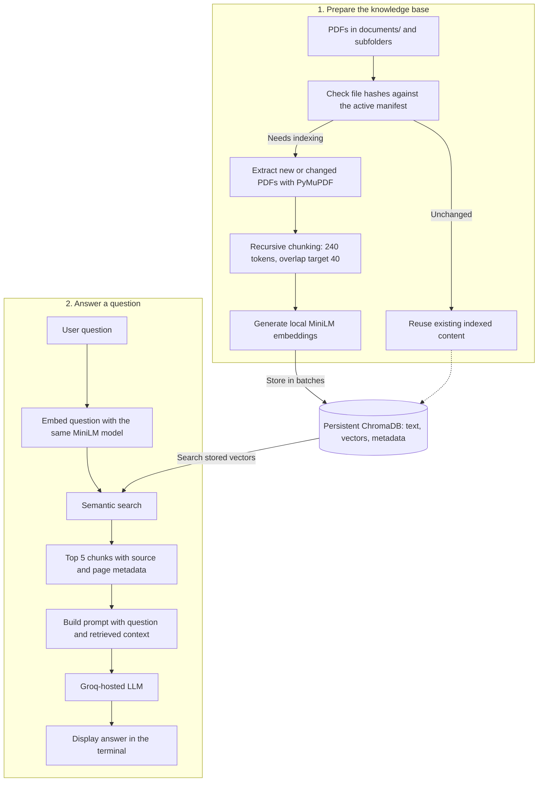
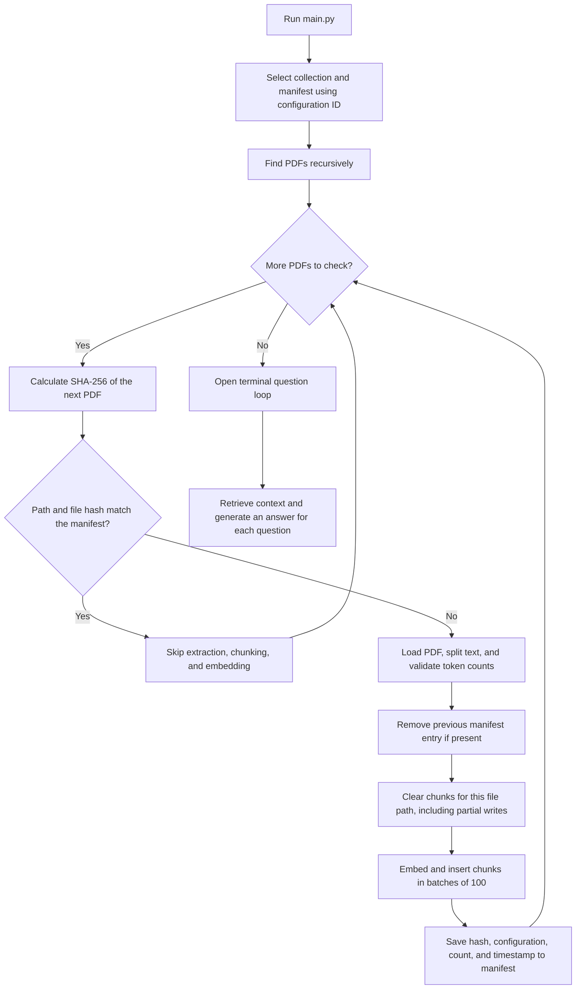

# Software Knowledge AI

> Enterprise Retrieval-Augmented Generation (RAG) for Software Architecture Knowledge

Software Knowledge AI is a document-based RAG application that transforms software architecture PDFs into a searchable knowledge base.

**Guides:** [Run and test the application](#5-run-the-application) |
[Baseline vs. improved: implementation and rationale](docs/rag-modes.md)

### Current ingestion behavior

Ingestion now uses recursive splitting measured with the embedding model's
tokenizer: a target of 240 content tokens with up to 40 tokens of overlap.
Every chunk is validated against that budget, with room for special tokens
inside MiniLM's 256-token input limit. Source and page metadata are preserved;
`token_count` records the content-token count.

Startup runs incremental ingestion each time. Unchanged files are skipped.
The embedding model, token limit, splitter version, size, and overlap determine
a configuration ID shared by retrieval and ingestion. Collections are named
`software_knowledge_base_<id>` and manifests `index_manifest_<id>.json`.
The first run after this change builds a new collection; the old collection
and manifest remain on disk. Changing these settings creates another index,
so the application cannot accidentally reuse vectors from incompatible settings.
Re-indexing can take time and retained collections consume additional disk space.

These token budgets are initial settings, not a measured optimum for answer
quality. Changing embedding models also requires reviewing its input limit.
Deleted PDFs are not yet removed automatically, and document replacement is
retryable but not transactional: a failed update can leave a partial document
until ingestion succeeds again. See the ingestion and manifest section below
for the current processing flow and stored metadata.

Instead of manually searching through multiple technical documents, an engineer can ask a question in natural language. The application retrieves relevant information from the indexed documents and uses an LLM to generate a grounded answer.

---

## Vision

Large engineering organizations maintain architecture documents, DevOps runbooks, cloud reference architectures, design decisions, operational guides, and technical documentation.

Traditional keyword search can locate documents containing specific words, but engineers still need to open multiple documents and manually identify the relevant information.

This project explores a different approach:

```text
Traditional Search

Engineer
   ↓
Keyword Search
   ↓
Multiple Documents
   ↓
Manual Reading
```

With Retrieval-Augmented Generation:

```text
Enterprise Knowledge AI

Engineer Question
      ↓
Semantic Search
      ↓
Relevant Document Context
      ↓
LLM
      ↓
Grounded Answer
```

The goal of this project is not just to build a chatbot, but to explore the architecture and engineering decisions involved in building an enterprise-oriented RAG system.

---

# High-Level Architecture

The application has two flows: preparing the knowledge base and answering questions.
Both use the same embedding model and configuration-specific Chroma collection.



Embeddings run locally; the question and retrieved context are sent to Groq for
answer generation. The prompt asks the model to use the context and acknowledge
missing information, but answer correctness and citations are not guaranteed.

---

# Technology Stack

| Technology | Purpose |
|---|---|
| Python | Application development |
| LangChain | RAG orchestration |
| HuggingFace | Local embedding generation |
| ChromaDB | Vector storage and similarity search |
| Groq | LLM inference |
| PyMuPDF | PDF document loading |
| uv | Python dependency and environment management |

---

# Project Structure

```text
software-knowledge-ai/
|-- documents/                  # Source PDFs, including subfolders
|-- src/
|   |-- config.py               # Paths, token budgets, index identity
|   |-- ingest/
|   |   |-- chunking.py          # Shared token-aware recursive splitting
|   |   |-- ingest.py            # Basic full-ingestion implementation
|   |   `-- enterprise_ingest.py # Active incremental ingestion
|   |-- search/retriever.py        # Original retriever
|   |-- search/scored_retriever.py # Shared scored search for selectable modes
|   |-- rag/rag.py                 # Original answer prompt and API
|   |-- rag/pipelines.py           # Baseline, improved, comparison reports
|   |-- llm/groq_llm.py
|   `-- learning/embeddings_lab.py # Optional standalone learning exercise
|-- docs/rag-modes.md              # Mode comparison, practices, and evaluation
|-- tests/test_ingestion.py
|-- tests/test_pipelines.py
|-- main.py
|-- .env.example
|-- .gitignore
|-- .python-version
|-- pyproject.toml
|-- uv.lock
`-- README.md
```

The following directories/files are generated locally and are intentionally not committed to GitHub:

```text
.env
.venv/
vector_db/
__pycache__/
```

---

# Prerequisites

Before running the project, install:

- Git
- Python
- uv
- A Groq API key

Check that Git is available:

```bash
git --version
```

Check Python:

```bash
python --version
```

Check uv:

```bash
uv --version
```

---

# Setting Up Groq for LLM Inference

## What is Groq?

Groq provides high-speed LLM inference and access to supported language models through an API.

This project uses Groq for generating answers after relevant context has been retrieved from the vector database.

The embedding model itself runs separately using HuggingFace.

---

## Create a Groq API Key

1. Open the Groq API Keys page:

   https://console.groq.com/keys

2. Sign in or create a Groq account.

3. Click **Create API Key**.

4. Enter a name for the key, for example:

   ```text
   software-knowledge-ai
   ```

5. Create the key and copy it.

6. Keep the API key secure. Do not commit it to GitHub.

---

# Clone and Run the Application

## 1. Clone the Repository

```bash
git clone https://github.com/amitabhraulo/software-knowledge-ai.git
```

Move into the project directory:

```bash
cd software-knowledge-ai
```

---

## 2. Install Dependencies

The project uses `uv` for Python dependency management.

Run:

```bash
uv sync
```

This creates a local virtual environment and installs the dependencies defined in:

```text
pyproject.toml
uv.lock
```

The generated `.venv/` directory is ignored by Git.

---

## 3. Configure Environment Variables

The repository contains:

```text
.env.example
```

Create a local `.env` file from it.

### Windows PowerShell

```powershell
Copy-Item .env.example .env
```

### macOS / Linux

```bash
cp .env.example .env
```

Open `.env` and configure your Groq settings:

```env
GROQ_API_KEY=groq_api_key
GROQ_MODEL=model_name
```

Replace the placeholder values with your actual Groq configuration.

> Never commit the `.env` file or your API key to GitHub.

---

## 4. Add Knowledge Documents

Place the PDF documents you want to query inside:

```text
documents/
```

For example:

```text
documents/
├── microservices-architecture.pdf
├── cloud-architecture.pdf
└── software-design-guide.pdf
```

These documents become the knowledge source for the RAG application.

---

## 5. Run the Application

Run the commands below from the repository root after `uv sync` and configuring
`GROQ_API_KEY` and `GROQ_MODEL` in `.env`. These commands work in Git Bash and
PowerShell. The first ingestion may download the embedding model and tokenizer.

**Add PDFs to `documents/` or its subfolders. No document names are required for
embedding.** Every application startup scans all PDFs, compares their hashes,
indexes new or modified files, and skips unchanged files.

To index documents separately, without opening the question loop (optional):

```bash
uv run python -m src.ingest.enterprise_ingest
```

If you already ran that command, proceed directly to any mode below. Startup
will check hashes again but will not regenerate embeddings for unchanged PDFs.
Ingestion checks are not a continuous file watcher; restart or rerun ingestion
after adding documents while the application is running.

### Old behavior: baseline mode

```bash
uv run python main.py --mode baseline
```

Enter a question about your PDFs, read the answer, and type `exit` or `quit`.
`uv run python main.py` without a mode also selects baseline.

### New behavior: improved mode

```bash
uv run python main.py --mode improved
```

Ask the same question. Inspect the answer, source IDs such as `[S1]`, and the
citation-check message. Optional filters and a distance cutoff are available,
but neither is enabled by default.

### Compare both with one question

```bash
uv run python main.py --mode compare --show-context
```

Enter a question once. The application runs baseline and then improved, and
prints both reports: retrieved candidates, source/page details, distances,
accepted/rejected chunks, answers, citation status, and timings. `--show-context`
also prints the complete candidate passages.

For one question followed by automatic exit:

```bash
uv run python main.py --mode compare --question "What is an API Gateway?" --show-context
```

Comparison can make two Groq calls per question. Both modes share the same
indexed documents, embedding model, collection, and LLM configuration. Switching
modes alone does not require rebuilding the index.

### Optional search controls

| Option | Purpose |
|---|---|
| `--top-k 3` | Retrieve up to three candidates instead of five in both modes. |
| `--source "example.pdf"` | Search an exact source filename in improved mode. |
| `--category general` | Search an exact category in improved mode; root-level PDFs use `general`. |
| `--max-distance 0.65` | Experimental cutoff: retain candidates at or below this raw distance in improved mode. |
| `--show-context` | Print full retrieved passages, including rejected candidates. |
| `--question "..."` | Answer once and exit instead of opening an interactive loop. |

Source/category options restrict **retrieval, not ingestion**. Omit them to search
all indexed PDFs. In compare mode, filters and cutoff apply only to improved;
baseline remains unfiltered. Baseline-only mode rejects those options.

`0.65` is an illustrative value, not a calibrated recommendation. The inspected
collection uses squared L2 distance, where lower is closer. The application
reads and labels the actual metric; distances are not confidence percentages.
Start without a cutoff and inspect representative results before selecting one.

## 6. Test the Modes and Ingestion

| Test | Action | What to check |
|---|---|---|
| New documents | Add PDFs and run ingestion | New files are indexed; unchanged PDFs are skipped. |
| Baseline vs. improved | Ask the same answerable question using compare mode | Read the evidence and check whether each answer is supported. |
| New PDF retrieval | Ask about content specific to a new PDF with `--show-context` | Check whether that PDF's passages appear; retrieval is not guaranteed to find every answer. |
| Unrelated question | Ask something outside the indexed documents | Check whether the model acknowledges missing evidence; without a cutoff, unrelated chunks can still be retrieved. |
| Unchanged files | Run ingestion again without edits | Expect zero new/changed files and existing files skipped. |
| Empty search scope | Run the command below with a nonexistent source | Expect no accepted chunks and `LLM called: False`. |

```bash
uv run python main.py --mode improved --source "nonexistent-document.pdf" --question "What is an API Gateway?"
```

This source filter is just a test of empty-evidence handling, not a required step
for normal use. Inspect retrieval alone after indexing, without calling Groq:

```bash
uv run python -m src.search.retriever
```

Run the automated regression suite:

```bash
uv run python -m unittest discover -s tests -v
```

The current suite contains 13 tests. Ingestion tests require the MiniLM tokenizer
in the local cache; normal ingestion downloads it when needed. Pipeline tests
simulate model replies and do not call Groq. Passing tests verify implementation
behavior, not the factual quality of answers about your PDFs.

For available options:

```bash
uv run python main.py --help
```

---

# Baseline vs. Improved RAG

| Behavior | Baseline | Improved |
|---|---|---|
| Original prompt | Preserved | Separate system instructions and evidence |
| Top-k retrieval | Unfiltered | Optional source/category filters and distance cutoff |
| Empty evidence | Original LLM-call behavior | Returns a message without calling the LLM |
| Source citations | Not required | Requests `[S#]` citations and checks source-ID ranges |
| Reports | Scored retrieval and timings | Also shows rejection and citation diagnostics |

Both are maintained runnable behaviors, not historical release labels. The
baseline CLI now includes diagnostics while preserving its original retrieval
policy and answer prompt. The improved label identifies added controls; it does
not claim experimentally proven answer-quality gains.

Read [Baseline and Improved RAG: design, code map, and best practices](docs/rag-modes.md)
for the complete comparison, implementation locations, rationale, known limits,
and a staged evaluation plan.

---

# Startup and Incremental Indexing Flow

`main.py` checks the documents before opening the question loop. The diagram
shows successful indexing; extraction, validation, or write errors stop the run.



A new configuration with no existing index gets its own collection and manifest,
so its PDFs are indexed even when their bytes have not changed. This is a startup
check, not a continuous file watcher. If no PDFs are present, ingestion returns
without building an index. The CLI then requires the active collection to exist; a fresh empty workspace cannot
open search until documents have been indexed.

---

# Implemented Features

The application runs one incremental ingestion pipeline through
`src/ingest/enterprise_ingest.py`, followed by retrieval and answer generation.

| Feature | What the current code does |
|---|---|
| PDF ingestion | Finds PDFs in `documents/` and its subfolders and extracts page text. |
| Token-aware chunking | Splits recursively with a 240-token budget and a 40-token overlap target, then validates chunk sizes. |
| Incremental indexing | Compares SHA-256 file hashes with the manifest and skips unchanged files. |
| Document updates | Validates replacement chunks, clears the affected file's old chunks, and inserts the new ones. |
| Configuration-specific indexes | Uses separate collections and manifests for different embedding/chunking settings. |
| Persistent storage | Saves text, metadata, and embeddings in local ChromaDB. |
| Batch insertion and retries | Inserts 100 chunks per batch and clears partial inserts for a file before retrying. |
| Semantic retrieval | Retrieves up to five chunks by default; selectable modes expose actual collection distances. |
| Improved RAG | Adds optional exact metadata filters, a configurable distance cutoff, an empty-evidence fallback, and source-ID citation checks. |
| Comparison mode | Runs the same question through baseline and improved pipelines and prints evidence, settings, answers, and timings. |
| Context-based answers | Sends retrieved passages to a Groq-hosted LLM with instructions to answer from that context. |

The original basic ingestion helpers remain as learning references; they are not
separate supported application versions. Use `main.py` for the application or
`python -m src.ingest.enterprise_ingest` for ingestion alone.

---

# Current Incremental Ingestion and Manifest

File hashes are stored in `vector_db/index_manifest_<configuration_id>.json`.
`src/config.py` defines its path as `MANIFEST_FILE`. Each key is a PDF path
relative to `documents/`, including subfolders when present.

Example entry (hash, count, and timestamp are illustrative):

```json
{
  "architecture.pdf": {
    "file_hash": "<SHA-256 of the PDF bytes>",
    "source": "architecture.pdf",
    "category": "general",
    "chunk_count": 100,
    "index_config": {
      "embedding_model": "sentence-transformers/all-MiniLM-L6-v2",
      "embedding_max_tokens": 256,
      "splitter": "recursive_embedding_tokens_v1",
      "chunk_size": 240,
      "chunk_overlap": 40
    },
    "indexed_at": "2026-09-27T10:00:00+00:00"
  }
}
```

Two fingerprints serve different purposes:

| Fingerprint | Purpose |
|---|---|
| File hash | Detects changes to a PDF's bytes, including PDF metadata changes. |
| Configuration ID | Identifies the embedding model, token limit, splitter version, chunk size, and overlap used for an index. |

`get_file_hash()` calculates the current file hash. `load_manifest()` reads saved
hashes. A matching path and hash causes the loop to skip PDF extraction,
chunking, embedding generation, and insertion. The file is still read to hash it.
Existing Chroma records remain available for question answering.

For a new or modified file, the current sequence is:

```text
Load PDF -> Split and validate chunks
         -> Invalidate previous manifest entry, if present
         -> Clear chunks belonging to this file path
         -> Insert new chunks in batches of 100
         -> Save successful indexing details
```

Deleting by file path avoids removing another document that happens to have the
same content hash. Clearing that path also removes partial inserts on retries.
`save_manifest()` writes a temporary file and then replaces the JSON manifest.
File hashes are additionally stored in chunk metadata, but the manifest drives
the unchanged-file check.

For example:

```text
Incremental ingestion completed.
Indexed new/changed files: 0
Updated files: 0
Skipped unchanged files: 3
```

This means three PDFs matched their saved hashes and none needed new embeddings.
`Updated files` is a subset of `Indexed new/changed files`, not an additional count.

A different configuration selects `software_knowledge_base_<configuration_id>`
and its matching manifest. A configuration with no existing index is indexed from
scratch; old collections remain on disk. Retrieval imports the same collection
name from `src/config.py`.

Use `main.py` or the enterprise ingestion module for normal updates. The basic
`src.ingest.ingest` and `ingest_documents_v1_simple()` paths reprocess documents
without maintaining the incremental manifest and can create duplicates.

## Run ingestion and checks

Refresh the index without starting question answering:

```powershell
uv run python -m src.ingest.enterprise_ingest
```

Run the regression tests:

```powershell
uv run python -m unittest discover -s tests -v
```

The chunking tests require the MiniLM tokenizer in the local Hugging Face cache;
a normal ingestion run downloads it if needed. Incremental tests use temporary
files and an in-memory vector-store substitute. They cover size validation,
metadata preservation, unchanged-file skipping, identical-file isolation,
partial-write retries, and a new configuration manifest. They do not measure
answer quality or exercise a real Chroma/Groq request end to end. Pipeline tests
use a simulated store and chat model to check filtering arguments, cutoff direction,
empty-evidence behavior, original versus improved prompts, and citation diagnostics.

After ingestion, inspect retrieval without calling Groq:

```powershell
uv run python -m src.search.retriever
```

To check incremental behavior, start `uv run python main.py`, exit, and start it
again without changing PDFs or configuration. Expect unchanged files to be skipped.

## Current operational limits

- Deleted PDFs are not removed from the index. Renames index the new path but leave old chunks.
- Replacement is retryable, not transactional; a failed write can leave partial content until a retry succeeds.
- Concurrent ingestion is not coordinated with locks; use one ingestion process at a time.
- A matching manifest entry does not verify that its database chunks are still present.
- Token-safe chunks do not establish retrieval or answer accuracy; evaluation is still needed.

---

# Retrieval and RAG Flow

When a user asks:

```text
What is the Saga Pattern?
```

the question is converted into an embedding using the same embedding model used during document ingestion.

```text
Question
   ↓
HuggingFace Embedding
   ↓
Vector Representation
   ↓
ChromaDB Similarity Search
   ↓
Top-K Relevant Document Chunks
```

The retrieved chunks are then combined into context:

```text
Question
   +
Retrieved Context
   ↓
Prompt
   ↓
Groq LLM
   ↓
Answer
```

The prompt instructs the model to answer using the retrieved context rather than relying only on the LLM's general knowledge.

If the requested information cannot be found in the indexed documents, the application is designed to respond accordingly.

---

# Sample Questions

Depending on the documents you index, example questions include:

```text
Explain CQRS.

Explain the Saga Pattern.

What is Database per Service?

What is an API Gateway?

How do microservices communicate with each other?

What are the benefits of microservices architecture?
```

You can also test grounding using a question unrelated to the indexed documents.

The expected behavior is for the application to indicate that the information could not be found in the knowledge base rather than inventing an answer.

---

# Architectural Trade-offs

The project explores several RAG architecture decisions:

### Chunk Size vs Context Quality

Smaller chunks can improve retrieval precision but may lose surrounding context.

Larger chunks preserve more context but may introduce irrelevant information.

### Top-K vs Context Size

Retrieving more chunks can increase recall but also increases the amount of context sent to the LLM.

### Local vs Hosted Embeddings

This project uses HuggingFace embeddings locally, avoiding an external embedding API dependency.

### ChromaDB vs Distributed Vector Databases

ChromaDB is suitable for local development and experimentation.

Larger enterprise deployments may require distributed vector databases depending on scale, availability, filtering, and operational requirements.

### Full vs Incremental Indexing

Full indexing is simple but inefficient as document repositories grow.

Incremental indexing reduces unnecessary embedding generation by processing only new or modified documents.

---

# Fresh Start / Rebuild the Knowledge Base

The vector database is generated locally.

To rebuild the knowledge base from scratch, stop the application and delete:

```text
vector_db/
```

Then run:

```bash
uv run python main.py
```

The application will regenerate embeddings and rebuild the ChromaDB database from the documents.

Python may also create directories such as:

```text
__pycache__/
```

These contain generated Python bytecode and can safely be ignored. They are excluded from Git using `.gitignore`.

---

# Security

Never commit secrets to source control.

The following file should remain local:

```text
.env
```

The repository provides:

```text
.env.example
```

only as a configuration template.

Generated runtime directories such as the following are also excluded:

```text
.venv/
vector_db/
__pycache__/
```

---

# Future Roadmap

Planned improvements include:

- Claim-level citation support evaluation (source-ID checks are implemented)
- Authenticated document permissions (source/category search filters are implemented)
- Hybrid search
- Cross-encoder reranking
- Improved chunking strategies
- Query rewriting
- Retrieval evaluation
- RAG evaluation framework
- Caching
- Guardrails
- Observability
- Chunk versioning
- Page-level hashing
- Qdrant / Milvus support
- API layer
- Docker support

---

# Learning Goal

This project is being developed incrementally to explore how a basic RAG pipeline can evolve toward a more reliable enterprise knowledge architecture.

The focus is not only on using an LLM, but on understanding the engineering decisions around:

```text
Document Ingestion
        +
Chunking
        +
Embeddings
        +
Vector Search
        +
Retrieval
        +
Context Construction
        +
LLM Generation
        +
Reliability
```

The project will continue to evolve as additional retrieval, evaluation, observability, and production-oriented patterns are introduced.
