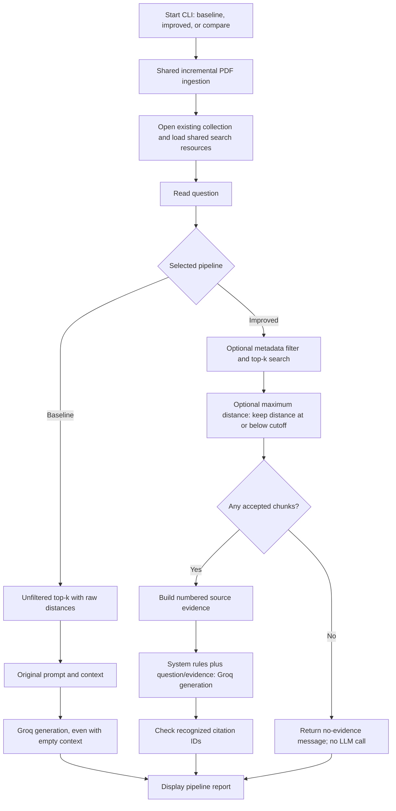

# Baseline and Improved RAG: Design and Implementation

[Back to README](../README.md) · [Run and test commands](../README.md#5-run-the-application)

This document describes the implemented application, why each change was made,
and how to compare the two answer pipelines. Both use the same ingestion pipeline
and stored knowledge base. There is no need to embed documents separately for
each mode or to specify filenames during ingestion.

## 1. What the previous pipeline did

The original public entry point remains available as `ask_question()` in
[src/rag/rag.py](../src/rag/rag.py). Its flow is:

```text
Question -> Retrieve up to five nearest chunks -> Format source/page/text
         -> Original single-message prompt -> Groq LLM -> Answer text
```

The prompt asks a software architecture assistant to answer only from the
retrieved context and acknowledge missing information. It already had grounding
instructions and source metadata; these are not new additions.

Its limitations were that retrieval did not expose scores to the caller, did not
apply optional search filters or a relevance cutoff, and did not explicitly
skip generation for empty evidence. The answer was plain text without required
source-ID citations or citation diagnostics.

## 2. What is preserved and what changed

`baseline` retains the original retrieval policy and answer prompt. The CLI uses
the new scored retrieval helper so both modes have comparable diagnostics. It
is therefore a preserved behavior with instrumentation, not a frozen copy of
every old function. The original `ask_question()` API still uses its original
retriever and returns text.

| Area | Baseline mode | Improved mode | Reason for the difference |
|---|---|---|---|
| PDF ingestion and vectors | Shared | Shared | Avoid duplicate pipelines and unnecessary re-embedding. |
| Search collection and embedding model | Shared | Shared | Keep the underlying retrieval setup consistent. |
| Candidate count | Default five; `--top-k` changes it | Same | Compare with a common retrieval budget. |
| Source/category restrictions | None | Optional exact matches, combined with AND | Let users narrow the evidence scope. |
| Distance cutoff | None | Optional inclusive maximum distance | Allow rejection of weak matches after calibration. |
| Empty evidence | Calls LLM with empty context | Returns before creating/calling LLM | Avoid generation without retrieved evidence. |
| Prompt roles | Original single human-message template | Separate system and human messages | Separate assistant rules from question/evidence. |
| Document instructions | Original grounding prompt | Explicitly treats evidence as untrusted reference text | Reduce instruction confusion from document content. |
| Source references | Metadata in context; no required citation format | Numbered `[S1]`, `[S2]` references | Connect answer references to displayed passages. |
| Citation checks | None | Checks recognized source IDs and flags missing citations | Make some citation failures visible. |
| LLM model/settings | Existing `get_llm()` configuration | Same | Avoid adding a model/settings change to the comparison. |
| Report | Sources, scores, timings, optional passages | Also acceptance/rejection and citation status | Make behavior inspectable. |

The improved mode does **not** enable a distance threshold automatically. With
no filters or cutoff, its primary differences are prompting, citation handling,
and the empty-result guard. It is normal for both answers to be similar.

## 3. Runtime flow



`compare` runs the baseline branch and then the improved branch for the same
question. It can make two LLM calls. It is an explicit comparison tool, not a
second embedding or ingestion mode.

## 4. File-by-file implementation map

| File | Functions/types | Responsibility and rationale |
|---|---|---|
| [main.py](../main.py) | `parse_args()`, `initialize_knowledge_base()`, `main()` | Validates mode/options, refreshes PDFs, loads common search resources, and displays one or both reports. Keeps the CLI separate from RAG logic. |
| [scored_retriever.py](../src/search/scored_retriever.py) | `get_search_store()` | Caches the search store and embedding wrapper within a process. Opens the existing collection with creation disabled rather than silently creating an empty index. |
| Same file | `build_filter()` | Builds exact source/category filters; combines both with `$and`. Rejects blank values. |
| Same file | `retrieve_scored()` | Reads the collection metric, retrieves document-distance pairs, validates scores, and applies the optional cutoff. |
| Same file | `Hit`, `Retrieval` | Keep candidate text, distances, acceptance decisions, filters, and cutoff together for diagnostics. `documents` exposes only accepted candidates. |
| [pipelines.py](../src/rag/pipelines.py) | `run_pipeline()` | Chooses original generation or improved evidence handling; measures retrieval/generation durations. |
| Same file | `compare_question()` | Runs both policies on the same question. Applies filters/cutoff only to improved mode. |
| Same file | `IMPROVED_PROMPT`, `evidence_context()` | Separates rules from evidence and assigns local source labels to accepted chunks. |
| Same file | `display_page()` | Uses a page label when available; otherwise converts integer PDF page indices to one-based display numbers. |
| Same file | `check_citations()` | Flags missing references or recognized `[S<number>]` IDs outside the supplied range. |
| Same file | `PipelineResult`, `format_result()` | Return structured results and render readable terminal diagnostics without putting reporting logic into the LLM prompt. |
| [rag.py](../src/rag/rag.py) | `generate_baseline_answer()`, `ask_question()` | Reuses the original prompt through an extracted generation function; preserves the original text-returning API. |
| [retriever.py](../src/search/retriever.py) | `get_retriever()` | Original retriever remains available, including its standalone retrieval inspection command. |
| [groq_llm.py](../src/llm/groq_llm.py) | `get_llm()` | Both modes use the same model selected by `GROQ_MODEL`. This change adds no temperature or output-budget setting. |

## 5. Retrieval practices: where and why

### Read the real metric instead of assuming cosine similarity

`retrieve_scored()` reads the active Chroma collection configuration. The existing
collection was inspected as `l2`, meaning squared L2 distance. It was not migrated
to cosine, and these new modes do not change collection settings.

Supported metrics are `l2`, `cosine`, and `ip`. The reported values are distances,
with lower meaning closer. They are not probabilities or accuracy percentages.
An unknown metric or non-finite distance causes an error instead of an ambiguous
report. The implementation currently accesses Chroma's underlying collection
through `_collection`, so compatibility should be reviewed on library upgrades.

The existing index fingerprint covers embedding/chunking settings, not an
explicit metric selection. A future metric change should also update index
identity and create an appropriate separate collection.

### Make thresholds optional and observable

The rule is `distance <= max_distance`. It is applied after retrieving up to
`top_k` candidates; discarded candidates are not replaced with additional hits.
The report retains rejected candidates for inspection, but improved generation
receives only accepted passages.

For illustration, distances `0.2, 0.6, 1.1` with a cutoff of `0.65` retain the
first two. This says nothing about whether either passage actually answers the
question. No cutoff has been calibrated, and there is no universal good score.

### Apply scope restrictions during vector search

`build_filter()` supplies metadata conditions to the Chroma query. `--source`
matches the filename stored at ingestion, while `--category` matches the parent
folder name (`general` for root-level PDFs). Both are exact matches.

These filters do not select files for embedding. Ingestion still scans all PDFs.
They are not access controls, and equal filenames in different folders can match
the same source filter. A future authorization design needs authenticated identity
and trusted document identifiers.

### Avoid rebuilding search objects for every question

`get_search_store()` uses `lru_cache(maxsize=1)`. The CLI initializes it before
running either pipeline, reducing repeated model-wrapper/store initialization.
This is resource reuse, not an answer cache or a guarantee of faster generation.

## 6. Generation and citation practices

### Distinguish no candidates from insufficient evidence

Improved mode returns early if no documents remain after search and cutoff.
The report shows `LLM called: False` and zero generation time. This is a
deterministic application decision.

If candidates remain but do not answer the question, the model is instructed to
reply `I could not find this in the indexed documents.` That decision is made by
the model and is not guaranteed. Without a calibrated cutoff, an unrelated
question can still retrieve passages and cause a model call.

### Separate instructions and evidence

`IMPROVED_PROMPT` uses system instructions and a human message containing the
question and an `<evidence>` block. It asks the model to ignore instructions
within source documents. This improves prompt organization but is not a complete
prompt-injection defense; evidence is not parsed or sanitized as a security boundary.

### Preserve source identity through context and output

`evidence_context()` assigns labels to accepted chunks in their retrieval order.
Each label maps to a filename, displayed page, and passage. IDs are local to the
answer, not persistent database chunk IDs. Two chunks from one PDF can receive
different labels, and `S1` in one pipeline need not mean `S1` in the other.

Baseline report labels are diagnostic only; its original prompt does not receive
the new numbered labels. Its original context also retains the original page
metadata formatting, while improved context and CLI reports use display pages.

### Validate references without overstating validation

`check_citations()` checks the exact recognized `[S<number>]` pattern:

- IDs outside `1..accepted_source_count` produce an invalid-ID message.
- No recognized IDs produces a missing-citation message, except for the exact
  configured insufficient-evidence response.
- In-range IDs produce a message explicitly saying claim support is unverified.

The answer is still displayed when this check fails. There is no automatic
repair, retry, or claim-by-claim fact check. A valid ID proves only that the
referenced source label exists, not that the statement follows from that source.

## 7. Existing ingestion practices shared by both modes

These were implemented before the selectable modes and should not be attributed
as new benefits exclusive to improved mode.

| Practice | Implementation location | Why it exists |
|---|---|---|
| Recursive PDF discovery | `enterprise_ingest.ingest_documents_incremental()` | Automatically handles PDFs under `documents/`, including subfolders. |
| SHA-256 file hashes | `enterprise_ingest.get_file_hash()` | Detects byte changes so unchanged PDFs avoid extraction and embedding work. |
| Persistent manifest | `load_manifest()` / `save_manifest()` | Remembers successfully indexed files across runs. JSON is written to a temporary file before replacement. |
| Configuration identity | [src/config.py](../src/config.py), `INDEX_CONFIG` / `INDEX_ID` | Separates embedding/chunking configurations into matching collection/manifest names. |
| Token-aware recursive splitting | [chunking.py](../src/ingest/chunking.py), `split_documents()` | Targets 240 content tokens with a 40-token overlap target and validates room for special tokens within the configured 256-token limit. |
| Shared splitter and cached tokenizer | `chunking.py` imported by both ingestion files | Avoids inconsistent splitting logic and repeated tokenizer initialization. |
| Source metadata | `load_pdf_documents()` and the shared splitter | Retains page, source, path, category, hash, and token count for traceability. |
| Validate before replacement | `ingest_documents_incremental()` | Parses and checks replacement chunks before removing existing content. |
| File-scoped cleanup and retries | `ingest_documents_incremental()` | Clears old/partial chunks for the file path without deleting another file with identical bytes. |
| Batch insertion | `add_chunks_in_batches()` | Writes up to 100 chunks per insertion call. |
| Environment-based model credentials | `groq_llm.py` and `.gitignore` | Loads local configuration without placing real secrets in committed source. |

The manifest lives at `vector_db/index_manifest_<configuration_id>.json`.
The file hash answers whether the PDF changed; the configuration ID answers
whether the selected embedding/chunking settings changed. An unchanged file is
still read for hashing. The basic ingestion helpers do not maintain the same
incremental guarantees; normal operation uses the enterprise ingester.

## 8. Run and inspect the modes

After installing dependencies, configuring `.env`, and adding PDFs, run from
the repository root in either Git Bash or PowerShell:

```bash
# Optional separate ingestion; all main.py modes also perform this check
uv run python -m src.ingest.enterprise_ingest

# Run the old policy
uv run python main.py --mode baseline

# Run new prompting, citation checks, and empty-evidence handling
uv run python main.py --mode improved

# Compare with no filename restrictions
uv run python main.py --mode compare --show-context

# Compare a single question and exit
uv run python main.py --mode compare --question "What is an API Gateway?"

# Optional: test a distance cutoff; 0.65 is illustrative, not calibrated
uv run python main.py --mode compare --max-distance 0.65 --show-context

# Optional: limit only improved retrieval to one source
uv run python main.py --mode improved --source "example.pdf" --show-context

# Confirm empty evidence avoids generation (use a filename not in the index)
uv run python main.py --mode improved --source "nonexistent-document.pdf" --question "What is an API Gateway?"
```

Type `exit` or `quit` to finish an interactive session. An invalid or missing
Groq configuration prevents live generation; a fresh empty index cannot answer
questions. The no-evidence guard applies to an existing searchable collection
with no accepted results, not to a missing collection or provider error.

An illustrative report fragment (not a measured result) is:

```text
--- IMPROVED ---
Metric: squared L2 distance (lower is closer; not a probability)
Filters: none; max distance: 0.65
Chunks accepted: 1/2
Retrieval: 0.050s; generation: 0.800s; LLM called: True

Retrieved candidates:
1. [S1] distance=0.2000 | architecture.pdf | page 12
2. [rejected] distance=0.9000 | architecture.pdf | page 18

Answer:
The gateway routes client requests to services. [S1]

Citation check: Source IDs are valid; whether they support each claim is not verified
```

With `--show-context`, the report also displays full text, including rejected
candidate passages. Those rejected passages are diagnostic output only.

## 9. Compare fairly and evaluate in stages

Keep PDFs, index settings, `GROQ_MODEL`, and `--top-k` constant for a comparison.
Start without filters or cutoff to isolate prompt/citation behavior as closely
as possible. Then add a cutoff, then scope filters, recording each change.

If filters are supplied, baseline still searches all documents while improved
uses the selected scope. That is a feature comparison, not identical evidence.
The two runs perform separate searches and generation requests. Shared settings
do not guarantee identical answers, and provider sampling defaults remain in use.

Retrieval timing includes the query embedding and search work. Generation timing
includes model-object creation when needed and the subsequent pipeline work.
The CLI excludes startup ingestion and common search initialization from these
timers. Compare runs baseline first, so warm caches and network variation can
affect timing. This is diagnostic instrumentation, not a controlled benchmark.

| Evaluation case | Expected observation to check |
|---|---|
| Answer exists in a new PDF | Relevant passages from that PDF appear and support the answer. |
| Answer spans passages | The accepted context covers all parts of the question. |
| Question is unrelated | The system avoids an unsupported answer; evaluate both retrieval and generation. |
| Filter matches no documents | Improved reports no accepted evidence and skips the LLM. |
| Cutoff rejects every candidate | Improved shows rejected candidates and skips the LLM. |
| Answer contains an invalid source ID | Citation status flags it; answer remains visible. |
| Restart with unchanged PDFs | Ingestion skips them; switching mode alone does not rebuild embeddings. |

Choose a threshold using labeled development questions and check it on separate
held-out questions. Record retrieval coverage, inappropriate refusals,
unsupported answers, citation support, latency, and LLM-call counts. No threshold
has been calibrated and no quality gain is established by these modes alone.

## 10. Tests and remaining work

Run all tests:

```bash
uv run python -m unittest discover -s tests -v
```

[test_ingestion.py](../tests/test_ingestion.py) contains five tests for token
limits, metadata, invalid budgets, unchanged/identical files, retries, and a new
configuration manifest. It needs the cached MiniLM tokenizer and uses temporary
files plus an in-memory substitute for vector writes.

[test_pipelines.py](../tests/test_pipelines.py) contains eight tests covering
filter construction, inclusive cutoff direction, unknown/non-finite score
handling, empty-evidence behavior, baseline versus improved prompt/context,
citation diagnostics, display pages, and CLI options. These simulate retrieval
and model replies; they do not make Groq calls. The current full suite has 13
tests, not an answer-quality benchmark.

Remaining work includes threshold calibration, claim-level citation evaluation,
generation context budgeting, stable chunk IDs, deleted/renamed-file cleanup,
transactional replacement, ingestion locking, and document permissions. Updates
are retryable but can leave partial content until a retry succeeds. Manifest
matches are not database-integrity checks. No scheduled watcher, reranking,
hybrid search, new vector database, or answer cache was added by these modes.

For public project descriptions, distinguish implemented controls from measured
outcomes: we can demonstrate filtering, cutoff behavior, citation diagnostics,
and skipped calls, but should only claim better accuracy or lower latency after
representative evaluation supports that claim.
